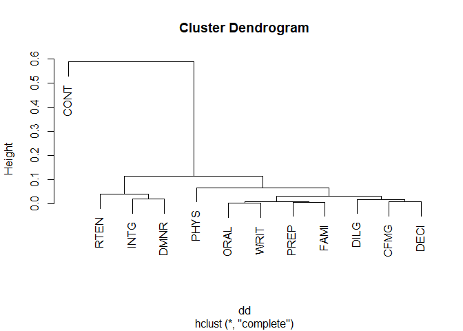

<!-- README.md is generated from README.Rmd. Please edit that file -->

# but

<!-- badges: start -->
<!-- badges: end -->

The goal of but is to allow users to easily edit existing functions to
suit their specific needs. Edit the formals of a function and apply
additional processing to its output.

## Installation

You can install the development version of but from
[GitHub](https://github.com/) with:

``` r
# install.packages("devtools")
devtools::install_github("hrryt/but")
```

## Examples

``` r
library(but)

# supply default arguments to read.table
read.csv |> but(stringsAsFactors = TRUE, strip.white = TRUE)
#> function (file, header = TRUE, sep = ",", quote = "\"", dec = ".", 
#>     fill = TRUE, comment.char = "", ..., stringsAsFactors = TRUE, 
#>     strip.white = TRUE) 
#> .f(file = file, header = header, sep = sep, quote = quote, dec = dec, 
#>     fill = fill, comment.char = comment.char, ..., stringsAsFactors = stringsAsFactors, 
#>     strip.white = strip.white)
#> <environment: 0x0000015f368119f8>

`+` #primitive
#> function (e1, e2)  .Primitive("+")
double <- `+` |> but(e2 = e1)
double(4)
#> [1] 8

start_repeats <- grepl |> but( #create new argument n
  x = , n = 2, pattern = sprintf("^%s{%i}", substr(x, 1, 1), n),
  .first = TRUE
)
start_repeats("hhi", 3)
#> [1] FALSE
start_repeats("Hhello", ignore.case = TRUE)
#> [1] TRUE

# an argument that references .out
(slapply <- lapply |> but(.out |> simplify2array()))
#> function (X, FUN, ...) 
#> {
#>     .out <- .f(X = X, FUN = FUN, ...)
#>     simplify2array(.out)
#> }
#> <environment: 0x0000015f36c596d0>
3:9 |> slapply(seq) |> slapply(fivenum, na.rm = FALSE)
#>      [,1] [,2] [,3] [,4] [,5] [,6] [,7]
#> [1,]  1.0  1.0    1  1.0  1.0  1.0    1
#> [2,]  1.5  1.5    2  2.0  2.5  2.5    3
#> [3,]  2.0  2.5    3  3.5  4.0  4.5    5
#> [4,]  2.5  3.5    4  5.0  5.5  6.5    7
#> [5,]  3.0  4.0    5  6.0  7.0  8.0    9
cor_dist <- cor |> but({
  dd <- as.dist((1 - .out)/2)
  plot(hclust(dd))
  dd
})
cor_dist(USJudgeRatings, method = "spearman") |> round(2)
```



    #>      CONT INTG DMNR DILG CFMG DECI PREP FAMI ORAL WRIT PHYS
    #> INTG 0.59                                                  
    #> DMNR 0.59 0.02                                             
    #> DILG 0.50 0.08 0.09                                        
    #> CFMG 0.44 0.12 0.11 0.02                                   
    #> DECI 0.46 0.10 0.10 0.01 0.01                              
    #> PREP 0.51 0.08 0.09 0.01 0.02 0.02                         
    #> FAMI 0.52 0.09 0.10 0.02 0.03 0.03 0.01                    
    #> ORAL 0.52 0.06 0.06 0.02 0.03 0.03 0.01 0.01               
    #> WRIT 0.52 0.07 0.08 0.02 0.03 0.02 0.01 0.01 0.00          
    #> PHYS 0.54 0.10 0.10 0.05 0.07 0.05 0.05 0.05 0.04 0.04     
    #> RTEN 0.52 0.04 0.04 0.03 0.05 0.03 0.03 0.04 0.01 0.02 0.05

    but(lm) # lm(weights = weights) will error if run
    #> function (formula, data, subset, weights, na.action, method = "qr", 
    #>     model = TRUE, x = FALSE, y = FALSE, qr = TRUE, singular.ok = TRUE, 
    #>     contrasts = NULL, offset, ...) 
    #> .f(formula = formula, data = data, subset = subset, weights = weights, 
    #>     na.action = na.action, method = method, model = model, x = x, 
    #>     y = y, qr = qr, singular.ok = singular.ok, contrasts = contrasts, 
    #>     offset = offset, ...)
    #> <environment: 0x0000015f35460cc0>
    # use .wrap = FALSE to avoid the pitfalls of
    # non-standard evaluation in the body of .f
    lm_for_pipe <- lm |> but(data = , .first = TRUE, .wrap = FALSE)
    mtcars |> subset(cyl == 4) |> lm_for_pipe(mpg ~ disp)
    #> 
    #> Call:
    #> lm_for_pipe(data = subset(mtcars, cyl == 4), formula = mpg ~ 
    #>     disp)
    #> 
    #> Coefficients:
    #> (Intercept)         disp  
    #>     40.8720      -0.1351

    # use .pass_all = FALSE to avoid passing
    # extra arguments to the dots of .f
    outer |> but(
      n = , X = seq_len(n), Y = X,
      .first = TRUE, .pass_all = FALSE
    ) |> print() |> do(4) |> print()
    #> function (n, X = seq_len(n), Y = X, FUN = "*", ...) 
    #> .f(X = X, Y = Y, FUN = FUN, ...)
    #> <environment: 0x0000015f345c3588>
    #>      [,1] [,2] [,3] [,4]
    #> [1,]    1    2    3    4
    #> [2,]    2    4    6    8
    #> [3,]    3    6    9   12
    #> [4,]    4    8   12   16

    (numbers <- seq(1, 3, 0.5))
    #> [1] 1.0 1.5 2.0 2.5 3.0
    but(split, f = floor(x))(numbers) #equivalent to using pipe
    #> $`1`
    #> [1] 1.0 1.5
    #> 
    #> $`2`
    #> [1] 2.0 2.5
    #> 
    #> $`3`
    #> [1] 3

    #dangerous; see warning
    `last<-` <- but(`[[<-`, x = , i = length(x), value = )
    #> Warning in but(`[[<-`, x = , i = length(x), value = ): .f is a primitive
    #> without a well-defined argument list
    last(numbers) <- 0
    numbers
    #> [1] 1.0 1.5 2.0 2.5 0.0
